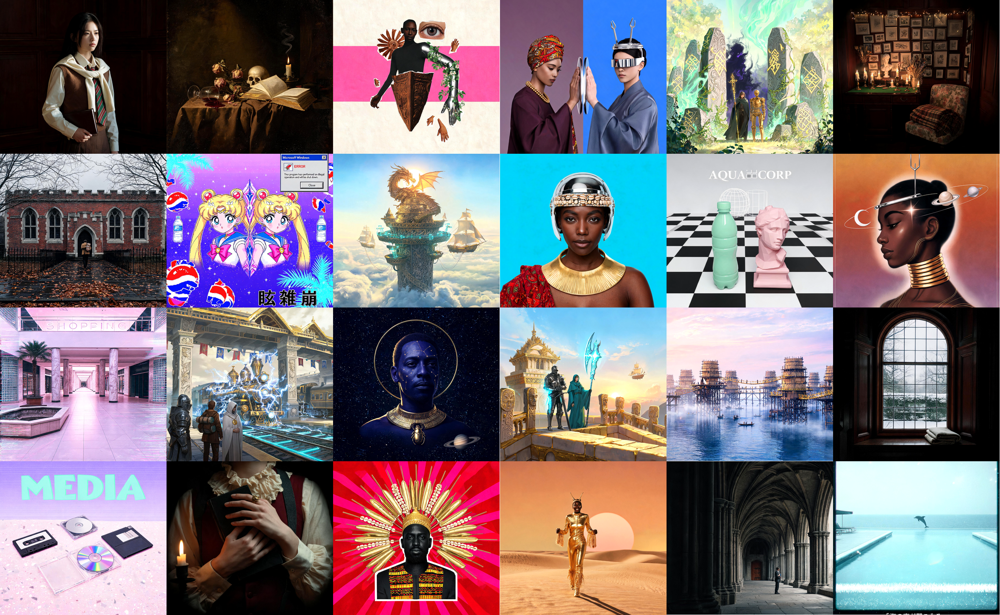

# OmniAes

A knowledge base of **1,040 aesthetic styles**, each summarized into a structured SKILL.md document derived from [Aesthetics Wiki](https://aesthetics.fandom.com).

## What's Inside

| Resource | Count |
|---|---|
| Aesthetic styles | 1,040 |
| SKILL.md documents | 1,040 |
| License | CC-BY-SA 3.0 |

## Moodboard

All images are AI-generated from prompts based on each style's `SKILL.md`.



## Directory Layout

```
OmniAes/
├── SKILL.md              # Project-level skill document
├── README.md             # This file
├── assets/
│   ├── styles.csv        # All styles with descriptions
│   └── moodboard.png     # Visual moodboard
└── aes/
    ├── Vaporwave/
    │   └── SKILL.md
    ├── Dark_Academia/
    │   └── SKILL.md
    └── ...               # 1,038 more styles
```

## SKILL.md Format

Each `aes/{Style}/SKILL.md` contains:

- **YAML frontmatter** — name, description, tier, neighbors, source URL
- **Visual Identity** — color palette (with hex codes), signature motifs ranked by importance, materials/textures
- **Generation Guidance** — principles, variation axes, "Avoid" section
- **Discrimination Cues** — comparison against visually similar styles

## License

This project is licensed under the **Creative Commons Attribution-ShareAlike 4.0 International License (CC-BY-SA 4.0)**.

- See [LICENSE](LICENSE) for the full license text.
- See [ATTRIBUTION.md](ATTRIBUTION.md) for attribution requirements.
- Content derived from [Aesthetics Wiki](https://aesthetics.fandom.com) (CC-BY-SA 3.0 community content).

## Source

All content summarized from [Aesthetics Wiki](https://aesthetics.fandom.com) page text.
